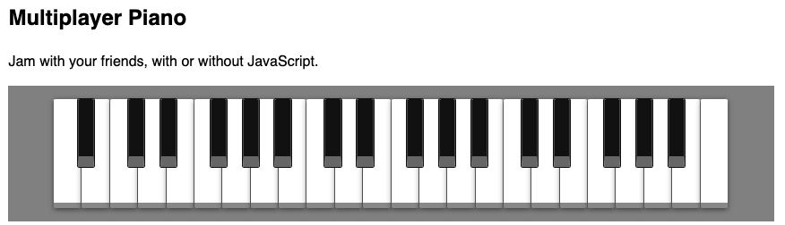

# Remix Piano Demos

## (Ab)use the Platform

### a.k.a. Building a Multiplayer Piano the "Wrong" Way

Let's learn and use web standards in an unconventional way 🥳 ... we're building a piano you can play with friends. That in and of itself isn't very interesting, but we're going to be using:

- [Remix](https://remix.run)
- [Forms](https://developer.mozilla.org/en-US/docs/Web/HTML/Element/form)
- [Web Audio](https://developer.mozilla.org/en-US/docs/Web/API/Web_Audio_API) (mostly via [Tone.js](https://tonejs.github.io/))
- [`<meta>`](https://developer.mozilla.org/en-US/docs/Web/HTML/Element/meta), [`<progress>`](https://developer.mozilla.org/en-US/docs/Web/HTML/Element/progress) and more
- [Browser history](https://developer.mozilla.org/en-US/docs/Web/API/History)
- [Progressive enhancement](https://developer.mozilla.org/en-US/docs/Glossary/Progressive_Enhancement)
- [Response](https://developer.mozilla.org/en-US/docs/Web/API/Response) and [Server-sent events](https://developer.mozilla.org/en-US/docs/Web/API/Server-sent_events/Using_server-sent_events)

In addition to the progressively-enhanced multiplayer piano, this repo also contains several intermediate iterations (no-op, client-side, and single-player).

## Quick Start

- clone the repo
- run `npm install`
- run `npm run dev`
- open your browser to `https://localhost:3000`

You might also need to go into your browser settings to allow sounds for localhost (or whatever host you run this on).

## But why?

A more conventional approach might be just to require client-side JavaScript with websockets and media streams. Why do it this way?

It's true this example is a bit contrived and the no-JS side of things is a little janky. That said:

1. This approach provides the same level of interactivity and peformance as other approaches
2. This approach ships less code to the browser than other approaches
3. This approach requires a comparable amount of code to write
4. We get progressive enhancement with minimal effort for free

If this approach works for building a multiplayer piano, then why _not_ do the same for traditional web apps, where it's even easier and the benefits are greater? 🤔

## Screenshot

